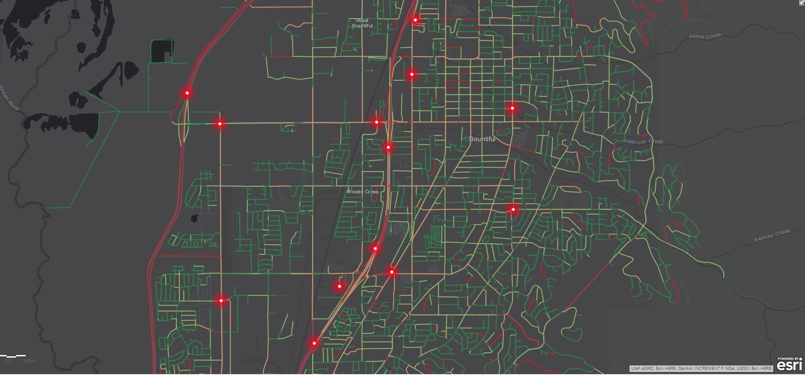
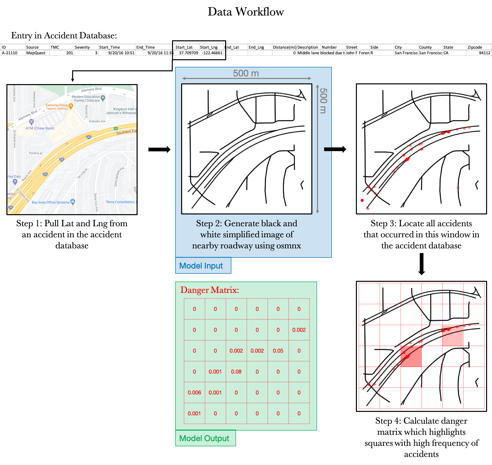
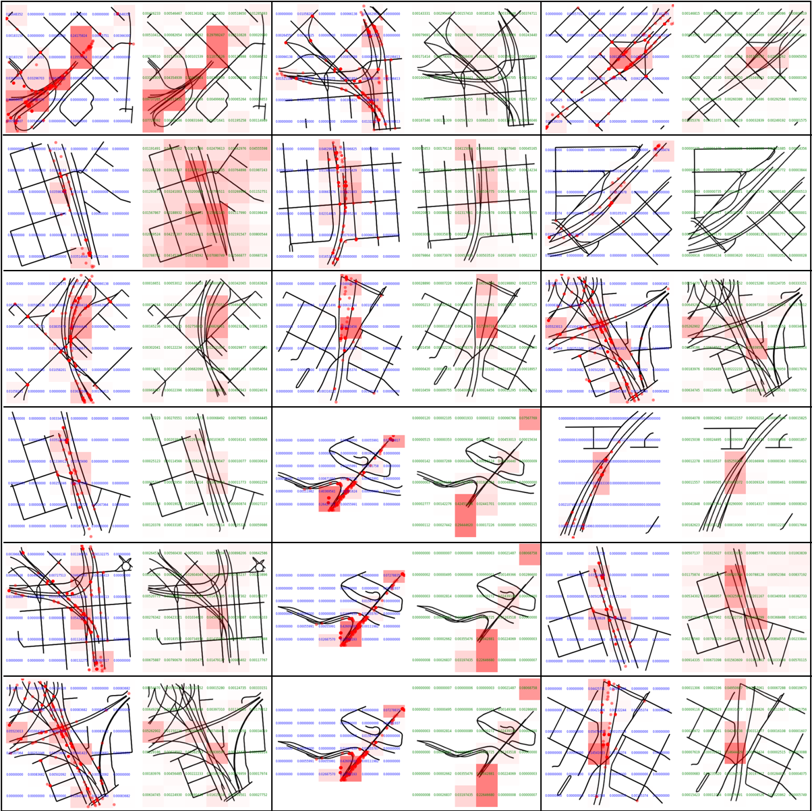

# crash_net

Predict traffic accidents from an image of the road network

## Quick Summary

This is the initial commit, mainly focused on data processing, of a crashNET neural network I'm building to predict traffic accident hotspots from images of road networks.

The python file data_process.py that's in the repo will generate the input image and output matrix I'm planning to use to train my CNN.

## The data I'm processing

The data I'm processing comes from two sources: a database (https://smoosavi.org/datasets/us_accidents) of 3.5 million US accidents recorded from February 2016 to June 2020, and the osmnx python package (https://geoffboeing.com/2016/11/osmnx-python-street-networks/) that can generate node/edge graphs of the road network anywhere in the US.

## How to run the code

First, I recommend creating a virtual environment using condas specifically for this data processing since osmnx requires a lot of dependencies. Once you've installed condas, run the code below to create an (ox) virtual environment.

```
conda config --prepend channels conda-forge
conda create -n ox --strict-channel-priority osmnx
```

To run the data_process.py script, you'll need two things:

- Accidents_by_zip.csv: this file is provided when you clone the repo. It's a tally of the number of accidents by zip code
- US_Accidents_June20.csv: this file you can download from [here](https://osmnx.readthedocs.io/) (this is the database from smoosavi referenced above)

If you run the following:

```
python data_process.py
```

the code will start generating input and output images for all the accidents that have occurred in SF and put them in the figs/ folder. This will take hours.

You can limit it to one accident using command line instructions:

- -a: String of accident ID, 'A-ID'. Eg 'A-809'
- -c: String of csv containing accident database. If you want to manually modify the 'US_Accidents_June20.csv' and rename it, this is where you would put the new title. But be careful, the code was written assuming the 'US_Accidents_June20.csv' is being loaded in.
- -d: int representing the size of the geographic window around the accident. default is 250m which gives a 500m x 500m window since distance is from center to edge
- -g: int representing grid size for the danger matrix.

Example Command Line Input (would recommend trying first):

```
python data_process.py -a 'A-809'
```

## Original Proposal

As a good Californian, I've spent a lot of time on the road, and, like many of us, I'm used to sitting in long traffic lines due to the inevitable car crash along my route. One of the things I've noticed is that these crashes seem to occur in the same spots along my routes, and, as some traffic accident prediction studies ([Antonio](https://towardsdatascience.com/live-prediction-of-traffic-accident-risks-using-machine-learning-and-google-maps-d2eeffb9389e), [Wilson](https://medium.com/geoai/using-machine-learning-to-predict-car-accident-risk-4d92c91a7d57)) have shown, there are often hot spots with a higher incidence of accidents. (Yay, it's not just confirmation bias!).



Many of the previous studies relied on inputs such as geospatial traffic data, weather, and road conditions to predict accidents. For my TDI project, I plan to take a new approach to predicting traffic accidents: I want to predict traffic crash hot spots purely using an image of the road geometry!

My hunch is that the geometric structure of the roads (the acuteness of turns, the length of merges, etc.) could be used to predict whether an area is more prone to accidents. (Plus, I'll get to play around with a convolutional neural network!).

### Data and Model Inputs/Outputs

I acquired my dataset by merging two main data sources: a [database](https://smoosavi.org/datasets/us_accidents) of 3.5 million US accidents recorded from February 2016 to June 2020, and the [osmnx](https://geoffboeing.com/2016/11/osmnx-python-street-networks/) python package that can generate node/edge graphs of the road network anywhere in the US.

The traffic accident database was provided by Sobhan Mosavi, a research scientist at Lyft, and provides 49 different features for each accident. The feature I was most interested in was the precise location of the accident and this dataset provided the latitude, longitude, zipcode, etc. quite cleanly and completely.

osmnx was built by Northeastern professor Geoff Boeing and combines [Open Street Map](https://www.openstreetmap.org/) (an open source Google Maps, basically) with [Networkx](https://networkx.github.io/) (a python package for network and graph theorists), to generate node/edge graphs or images of the road network at a location that can be specified with latitude and longitude.

I plan to combine these two sources to create a series of input images and output "danger matrices". Each input image will be a window centered around the latitude and longitude of single accident (i.e. row) in the accident database. The input image will be a black and white simplification of a road network that captures the key geometric features. To generate the output danger matrix, I will use the database to find all the accidents that occurred within this window and use them to calculate a matrix of danger coefficients. This matrix can be thought of as a grid that can be overlaid on the image where each cell's danger coefficient would represent a sort of normalized accident frequency. Cells with more accidents, and therefore more dangerous geometric features, would have higher coefficients.

Specifically, the danger coefficient is calculated by dividing the number of accidents that occurred in that cell by the total number of accidents that have occurred in that zip code. I introduced this normalization because I'm assuming that big cities have higher accident rates because they have more traffic, not necessarily because their road geometries are inherently more dangerous. I want the model to learn about the intrinsic danger of a road geometry, and hopefully avoid the confusing scenario where similar geometries having wildly different accident rates because one happens to be present in a populated city. I also dropped accidents from the database that occurred in zip codes that had fewer than 100 reported accidents. This was to avoid cases where danger coefficients may be artificially too high because there were only a handful of accidents reported in that zip code.

So far, I've generated the input images and output danger matrices for all the accidents that occurred in San Francisco that were present in the database. Below is a representative example of the data generation process for an accident that occurred near the 280-101 merge in Daly City.



The danger matrix highlights two squares within this window as dangerous, and this is likely because there are merges and exits located in those squares. The hope is that the model will learn that features such as those are dangerous. I plan to use a convolutional neural network, built in keras, to implement this.

### Project Deliverable

If this project works, my goal would be to create an app and/or website where a city planner, civil engineer, or even a concerned citizen, could provide a location, and my model would provide a map with an overlaid danger matrix highlighting how dangerous different features are. Since the model will be trained on simple black and white images, a user could even submit a drawing of a proposed road network and the model could tell the user how dangerous the design would be.

I also think this model could be part of a bigger pipeline of traffic accident prediction. One could imagine that the outputted "danger matrix" could be combined with additional input features such as speed limits, weather, road conditions, etc., and fed into another model that could make even better traffic accident predictions. The danger matrix would provide the average or intrinsic danger of a roadway, while features such as weather and road conditions would modulate that danger to specific conditions.

### Knobs left to turn

The ideas discussed so far are my initial thoughts after a few days of playing around with osmnx and the traffic accident data. I've listed a few potential things below that I still want to play with:

- **Size of accident window:** Currently, I'm using a 500m x 500m window centered around an accident for each training example. I think that generally limits the number of dangerous features per window to about 0-3. If I make the window bigger such that there are more dangerous features, it may be asking the model to do too much, but if I zoom in any further, I think there wouldn't be enough geometry for the model to be able to learn anything. I'll likely have to try different window sizes.

- **Network vs image?:** Osmnx is quite awesome and can also return a network object that contains a list of nodes and edges (i.e. a list of numbers). This could be used instead of an image as an input to the model. The two main challenges here are that the number of nodes and edges can vary dramatically, and the nodes and edges need to somehow be ordered so that the model understands what it's getting.

- **Generating null examples:** Since I'm using an accident database, all the locations I'll be inputting to the model will have had at least one accident. For the model to not artificially learn that every input is dangerous, I'll likely need to generate many null examples of "safe" areas where accidents have not occurred.

- **Avoiding overemphasizing the center of the image:** As each training example will have an accident centered at the image, the model could learn that the center is always dangerous. To eliminate this artificial bias, I will likely have to shift the window ​in a random direction and by a random distance. This will also prevent very similar images from being inputted many times into the model because a lot of accidents occurred in a single spot.

### Preliminary Results


